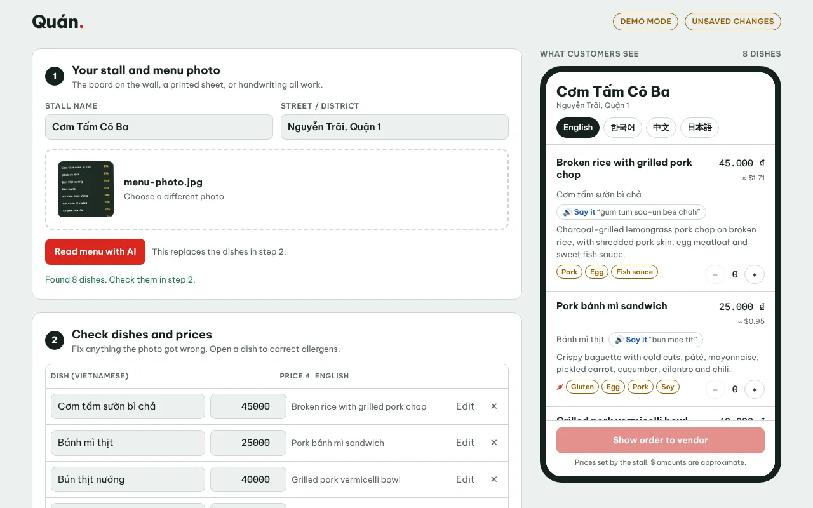
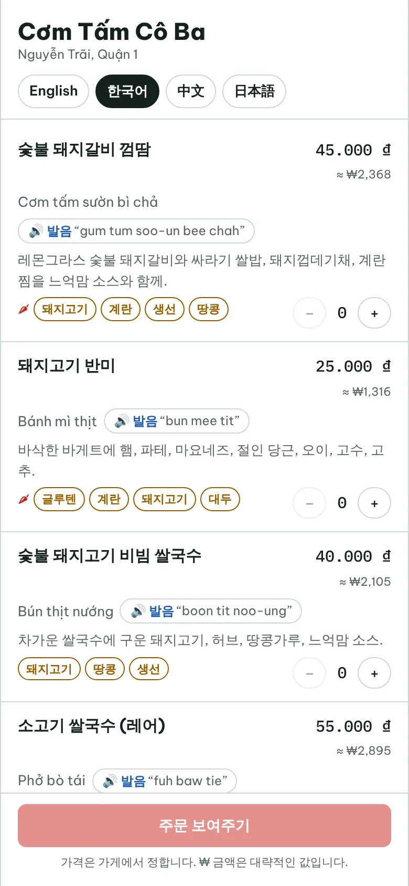
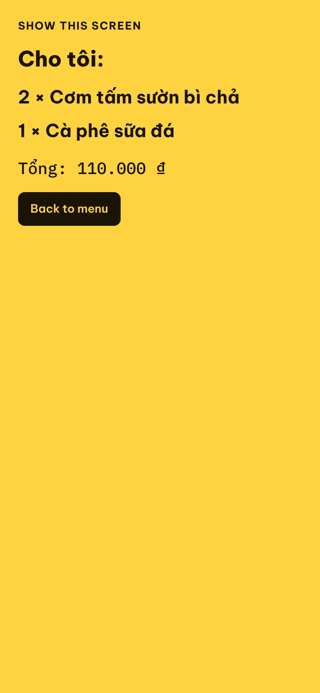

# Quán

**Live demo:** https://quan-menu-indol.vercel.app · example menu: https://quan-menu-indol.vercel.app/m/demo

Photo-to-QR menus for Ho Chi Minh City street-food stalls. A vendor photographs their menu, AI reads the dishes and prices, the vendor checks them, and Quán prints a QR sticker. Customers scan it and see every dish in English, Korean, Chinese or Japanese, with allergens, an approximate price in their own currency, a "say it" button, and an order screen they can show the vendor.



| Customer menu (Korean) | Order screen |
|---|---|
|  |  |

**Stack:** Next.js 15 (App Router, TypeScript) · Supabase (Postgres, auth, row-level security) · Claude API (vision) · `qrcode` · deploys to Vercel.

## Run it in 1 minute (demo mode)

```bash
npm install
cp .env.example .env.local
npm run dev
```

Open http://localhost:3000. With no Supabase keys the app runs in **demo mode**: no login, and the vendor's menu is saved in the browser. Everything works except photo reading and AI translation, which need `ANTHROPIC_API_KEY`. Common dishes still translate from the built-in list.

## Full setup

1. **Supabase.** Create a free project at supabase.com. Open **SQL Editor**, paste in `supabase/schema.sql` and run it. Under **Project Settings → API**, copy the Project URL and the `anon` public key.
2. **Login emails.** Under **Authentication → URL Configuration**, set Site URL to your site's address and add `https://YOUR-SITE/auth/callback` to Redirect URLs. (Add `http://localhost:3000/auth/callback` too for local development.)
3. **Claude API (optional).** Create a key at console.anthropic.com. Without one, the app hides photo reading, and vendors type their dishes; the 156 dishes on the built-in list (`src/lib/dishes.ts`) fill in their translations by themselves.
4. **Fill `.env.local`:**

   ```
   NEXT_PUBLIC_SUPABASE_URL=https://xxxx.supabase.co
   NEXT_PUBLIC_SUPABASE_ANON_KEY=eyJ...
   NEXT_PUBLIC_SITE_URL=http://localhost:3000
   ANTHROPIC_API_KEY=sk-ant-...
   ```

5. `npm run dev`, go to `/login`, enter your email, click the link, and build your menu.

## Deploy to Vercel

Push the repo to GitHub, import it at vercel.com/new, add the four variables above (with `NEXT_PUBLIC_SITE_URL` set to your Vercel address), and deploy. Then update the Supabase redirect URL from step 2 to the Vercel address.

Open `https://YOUR-SITE/api/health` after deploying. It lists any missing setting (yes/no only, never the values) and shows `"ok": true` when the required ones are in place. `ANTHROPIC_API_KEY` is listed under `optional`.

Set `NEXT_PUBLIC_SITE_URL` **before** printing stickers. The QR code contains this address.

## How it's built

| Path | What it does |
|---|---|
| `src/app/page.tsx` | Landing page |
| `src/app/login`, `src/app/auth/callback` | Email magic-link sign-in |
| `src/app/dashboard` | Vendor editor: photo → AI → edit dishes and allergens → publish → QR sticker. `actions.ts` saves through the `save_menu` database function. |
| `src/app/m/[slug]` | Public customer menu (what the QR code opens). Cached and served to every scanner, rebuilt at most once a minute, and refreshed immediately when the vendor saves. |
| `src/app/api/extract` | Photo → dishes, using Claude vision. Signed-in vendors only. |
| `src/app/api/translate` | Names of new dishes → translations, allergens, pronunciation (the editor sends 15 at a time) |
| `src/app/api/health` | Deployment check: which settings are missing |
| `src/components/MenuView.tsx` | Customer menu, also used as the live phone preview |
| `src/lib/dishes.ts` | Built-in translations for 156 common Saigon dishes and drinks. Used before any AI call, so known dishes cost nothing; matching ignores tone marks, portion notes and prices. |
| `src/lib/ai.ts` | Claude API calls: prompts, JSON-schema structured output, time budget, error messages |
| `supabase/schema.sql` | Tables, row-level security, the atomic `save_menu` function, and the daily AI allowance |

**Security model:** anyone can read a stall marked live. Only its owner can read a draft or change anything; this is enforced by Postgres row-level security, not just the app. The AI routes refuse anyone who isn't signed in, and each vendor gets 40 AI calls per day (the `take_ai_call` function in `supabase/schema.sql`; change the number there). In demo mode the AI routes only work during local development, so a deploy missing its Supabase settings can't be used to spend your API credit.

**Photos** are shrunk in the browser to 1600 px and sent straight to Claude. They are not stored. Reading a second photo adds its dishes to the list, so a long menu can be read in parts.

**Time limit:** each AI call must finish within 60 seconds (the route's `maxDuration`). Calls use `low` effort to stay fast; set `ANTHROPIC_EFFORT=medium` if menus are misread.

## Known limits / next steps

- **Pronunciation** uses the phone's built-in voice. Some phones have no Vietnamese voice, and then customers fall back to reading the spelling guide. A cloud text-to-speech service (for example Google TTS) would fix this.
- **Currency rates** are fixed in `src/lib/i18n.ts`. Update them by hand, or fetch daily rates.
- Each account has **one stall**. Supporting several would need a stall picker.
- **Payments** (a monthly vendor plan) aren't built yet. Stripe or PayOS/MoMo for Vietnam would be the next step.
- There is **no admin view and no analytics**. "How many scans did my sticker get?" would be a strong reason for vendors to pay.
